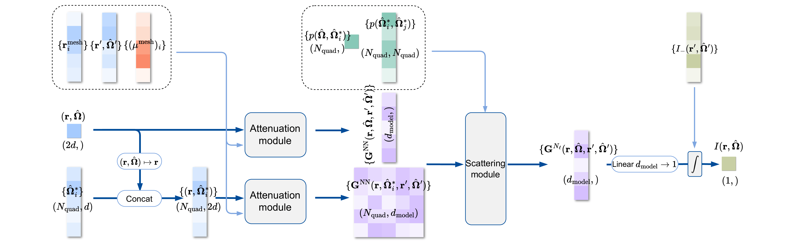

# DeepRTE: Neural Operator for Radiative Transfer

[**Overview**](#overview) | [**Setup**](#setup) | [**Datasets and Pretrained Models**](#datasets-and-pretrained-models) | [**Run DeepRTE**](#run-deeprte) | [**Pretrain DeepRTE**](#pretrain-deeprte) | [**Citing This Work**](#citing-this-work) | [**Acknowledgements**](#acknowledgements) | [**Get in Touch**](#get-in-touch)

_DeepRTE is a neural operator architecture designed to solve the Radiative Transfer Equation (RTE) in phase space. This repository provides code, configuration, and utilities for training, evaluating, and experimenting with DeepRTE models using both MATLAB and Numpy datasets._

## Overview

DeepRTE learns the solution operator:

```math
  \mathcal{A}: (I_{-}; \mu_t, \mu_s, p) \to I,
```

for the following steady-state radiative transfer equation:

```math
  \Omega \cdot \nabla I(r,\Omega)+\mu_t(r)I(r, \Omega) = \mu_s(r)\int p(\Omega,\Omega^*)I(r,\Omega^*)d\Omega^*,
```

with the in-flow boundary condition:

```math
  I(\mathbf{r},\mathbf{\Omega}) = I_{-}(\mathbf{r},\mathbf{\Omega}), \quad\text{on } \Gamma_{-},
```

where

```math
  \Gamma_{-} = \{(\mathbf{r},\mathbf{\Omega}) \mid \mathbf{n}_{\mathbf{r}}\cdot\mathbf{\Omega}<0 \}.
```

### Architecture

<div style="display: flex; justify-content: center;">
  
</div>

## Setup

### 1. Clone the Repository

```bash
git clone https://github.com/mazhengcn/deeprte.git --branch v1.0.0
cd deeprte
```

### 2. Install Dependencies

This project uses [jax-ai-stack](https://github.com/jax-ml/jax-ai-stack) (JAX, Flax, Optax, Orbax, etc.). The recommended way to install dependencies is with [`uv`](https://github.com/astral-sh/uv):

```bash
uv sync
```

This installs all necessary dependencies, including the project itself. For NVIDIA GPU support, use:

```bash
uv sync --extra cuda
```

For development, run:

```bash
uv sync --dev --all-extras
```

to install all development dependencies.

### 3. Container

A pre-built runtime container is available. To pull the latest image, run:

```bash
docker pull ghcr.io/mazhengcn/deeprte:1.0.0
```

Start the container with:

```bash
docker run -it --gpus=all --shm-size=1g ghcr.io/mazhengcn/deeprte:latest /bin/bash
```

Alternatively, if you prefer to build the image yourself, use the provided [Dockerfile](./Dockerfile):

```bash
docker build -t deeprte .
```

#### Dev Container

For development, a [devcontainer](https://code.visualstudio.com/docs/devcontainers/containers) is provided to ensure a reproducible environment. Simply open the repository root in VSCode, and the container will be built automatically with all required dependencies, development tools, and data volume mounts. Python and its dependencies are managed by `uv`.

The devcontainer configuration files are located in the [.devcontainer/](./.devcontainer) directory and can be customized as needed.

## Datasets and Pretrained Models

### Download Datasets

Datasets for training and testing DeepRTE are generated using conventional numerical methods in MATLAB and Python. The source code is available in a separate repository: [rte-dataset](https://github.com/mazhengcn/rte-dataset). For more details, refer to that repository.

Inference (test) and pretraining datasets are hosted on Huggingface: https://huggingface.co/datasets/mazhengcn/rte-dataset. Download datasets to `DATA_DIR` with (ensure `huggingface-cli` is installed; if you followed the setup above, it is already included):

```bash
huggingface-cli download mazhengcn/rte-dataset \
    --exclude=interim/* \
    --repo-type=dataset \
    --local-dir=${DATA_DIR}
```

The resulting folder structure should be (for inference, only datasets under `raw/test` are needed):

```bash
${DATA_DIR}
├── processed
│   └── tfds      # Processed TFDS dataset for pretraining.
├── raw
│   ├── test      # Raw MATLAB dataset for test/inference.
│   └── train     # Raw MATLAB dataset for pretraining using grain.
└── README.md
```

Each MATLAB dataset contains the following keys:

| Key            | Array Shape     | Description                                 |
| -------------- | --------------- | ------------------------------------------- |
| `list_Psi`     | `[2M, I, J, N]` | Numerical solutions (labels)                |
| `list_psiL`    | `[M, J, N]`     | Left boundary values                        |
| `list_psiR`    | `[M, J, N]`     | Right boundary values                       |
| `list_psiB`    | `[M, I, N]`     | Bottom boundary values                      |
| `list_psiT`    | `[M, I, N]`     | Top boundary values                         |
| `list_sigma_a` | `[I, J, N]`     | Absorption coefficient                      |
| `list_sigma_T` | `[I, J, N]`     | Total coefficient                           |
| `ct`, `st`     | `[1, M]`        | Discrete velocity coordinates (quadratures) |
| `omega`        | `[1, M]`        | Weights of velocity coordinates             |

### Download Pretrained Models

Pretrained models can be downloaded to `MODEL_DIR` from Huggingface:

```bash
huggingface-cli download mazhengcn/deeprte \
    --repo-type=model \
    --local-dir=${MODELS_DIR}
```

The folder structure will be:

```bash
${MODELS_DIR}
├── README.md
├── v0                    # Pre-release version (deprecated).
└── v1                    # Current release models for different scattering kernel ranges.
    ├── g0.1
    │   ├── config.json
    │   └── params
    ├── g0.5
    │   ├── config.json
    │   └── params
    └── g0.8
        ├── config.json
        └── params
```

A convenient shell script [scripts/download_dataset_and_models.sh](./scripts/download_dataset_and_models.sh) is provided to download datasets to [./data](./data/) and pretrained models to [./models](./models/):

```bash
uv run ./scripts/download_dataset_and_models.sh
```

## Run DeepRTE

To run DeepRTE inference:

```bash
uv run run_deeprte.py --model_dir=${MODEL_DIR} --data_path=${DATA_PATH} --output_dir=${OUTPUT_DIR}
```

where `${MODEL_DIR}` is the pretrained model directory, `${DATA_PATH}` is the data path for inference, and `${OUTPUT_DIR}` is the directory to store results.

For example:

```bash
DATA_PATH=${1:-"./data/raw/test/sin-rv-g0.5-amplitude5-wavenumber10/sin-rv-g0.5-amplitude5-wavenumber10.mat"}
MODEL_DIR=${2:-"./models/v1/g0.5"}
OUTPUT_DIR=${3:-"./reports"}

TIMESTAMP="$(date --iso-8601="seconds")"

python run_deeprte.py \
  --model_dir="${MODEL_DIR}" \
  --data_path="${DATA_PATH}" \
  --output_dir="${OUTPUT_DIR}/${TIMESTAMP%+*}"
```

A shell script [./scripts/run_deeprte.sh](./scripts/run_deeprte.sh) containing above contents is also provided for convenience, you can modify it and run:

```bash
uv run ./scripts/run_deeprte.sh
```

## Pretrain DeepRTE

To train DeepRTE from scratch, run:

```bash
uv run run_train.py --config=${CONFIG_PATH} --workdir=${CKPT_DIR}
```

After training, checkpoints are saved under `${CKPT_DIR}`. To generate an inference checkpoint, run:

```bash
uv run generate_param_only_checkpoint.py --train_state_dir=${TRAIN_STATE_DIR} --checkpoint_dir=${CKPT_DIR}
```

You can also modify and run the convenient scripts:

```bash
uv run ./scripts/run_train.sh
```

```bash
uv run ./scripts/generate_param_only_checkpoint.sh
```

## Citing This Work

Any publication that discloses findings arising from using this source code, the model parameters or outputs produced by those should cite:

```bibtex
@misc{zhu2025,
      title={DeepRTE: Pre-trained Attention-based Neural Network for Radiative Tranfer},
      author={Yekun Zhu and Min Tang and Zheng Ma},
      year={2025},
      eprint={2505.23190},
      archivePrefix={arXiv},
      primaryClass={cs.LG},
      url={https://arxiv.org/abs/2505.23190},
}
```

## Acknowledgements

DeepRTE's release was made possible by the invaluable contributions of the following people:
Zheng Ma, Yekun Zhu, Min Tang and Jingyi Fu.

DeepRTE uses the following separate libraries and packages:

*   [abseil-cpp](https://github.com/abseil/abseil-cpp) and
    [abseil-py](https://github.com/abseil/abseil-py)
*   [clu](https://github.com/google/CommonLoopUtils)
*   [Docker](https://www.docker.com)
*   [Grain](https://github.com/google/grain)
*   [Hugging Face](https://huggingface.co)
*   [JAX](https://github.com/jax-ml/jax)
*   [Flax](https://github.com/google/flax)
*   [Optax](https://github.com/google-deepmind/optax)
*   [NumPy](https://github.com/numpy/numpy)
*   [Tensorflow](https://github.com/tensorflow/tensorflow)
*   [uv](https://github.com/astral-sh/uv)

We thank all their contributors and maintainers!

## Get in Touch

If you have any questions not covered in this overview, please open an issue or contact the Zheng Ma at zhengma@sjtu.edu.cn.
